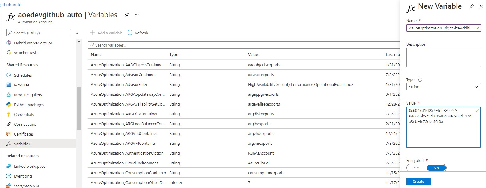

# Configuring Log Analytics workspaces

## Validating performance counters collection

If you want to fully leverage the VM right-size augmented recommendation, you need to have your VMs onboarded to a Log Analytics workspace (it should normally be the one you chose at installation time) and you need them to send specific performance counters. The list of required counters is defined [here](../perfcounters.json). The AOE provides a tool - the [Setup-LogAnalyticsWorkspaces.ps1](.\Setup-LogAnalyticsWorkspaces.ps1) script - that helps you validate and fix the configured Log Analytics performance counters. In its simplest form of usage, it looks at all the Log Analytics workspaces you have access and, for each workspace with Azure VMs onboarded, it validates performance counters configuration and tells you which counters are missing. But you can target a specific workspace and, if required, automatically fix the missing counters. See usage details below.

### Requirements

You need first to install the Azure Resource Graph PowerShell module:

```powershell
Install-Module -Name Az.ResourceGraph
```
### Usage

```powershell
./Setup-LogAnalyticsWorkspaces.ps1 [-AzureEnvironment <AzureChinaCloud|AzureUSGovernment|AzureGermanCloud|AzureCloud>] [-WorkspaceIds <comma-separated list of Log Analytics workspace IDs to validate>] [-IntervalSeconds <performance counter collection frequency - default 60>] [-AutoFix]

# Example 1 - just check all the workspaces configuration
./Setup-LogAnalyticsWorkspaces.ps1

# Example 2 - fix all workspaces configuration (using default counter collection frequency)
./Setup-LogAnalyticsWorkspaces.ps1 -AutoFix

# Example 3 - fix specific workspaces configuration, using a custom counter collection frequency
./Setup-LogAnalyticsWorkspaces.ps1 -AutoFix -WorkspaceIds "d69e840a-2890-4451-b63c-bcfc5580b90f","961550b2-2c4a-481a-9559-ddf53de4b455" -IntervalSeconds 30
```

## Using multiple Log Analytics workspaces for VM performance metrics

If you have VMs onboarded to multiple Log Analytics workspaces and you want them to be fully included in the VM right-size recommendations report, you can add those workspaces to the solution just by adding a new variable to the AOE Azure Automation account. In the Automation Account _Shared Resources - Variables_ menu option, click on the _Add a variable button_ and enter `AzureOptimization_RightSizeAdditionalPerfWorkspaces` as the variable name and fill in the comma-separated list of workspace IDs (see example below). Finally, click on _Create_.

